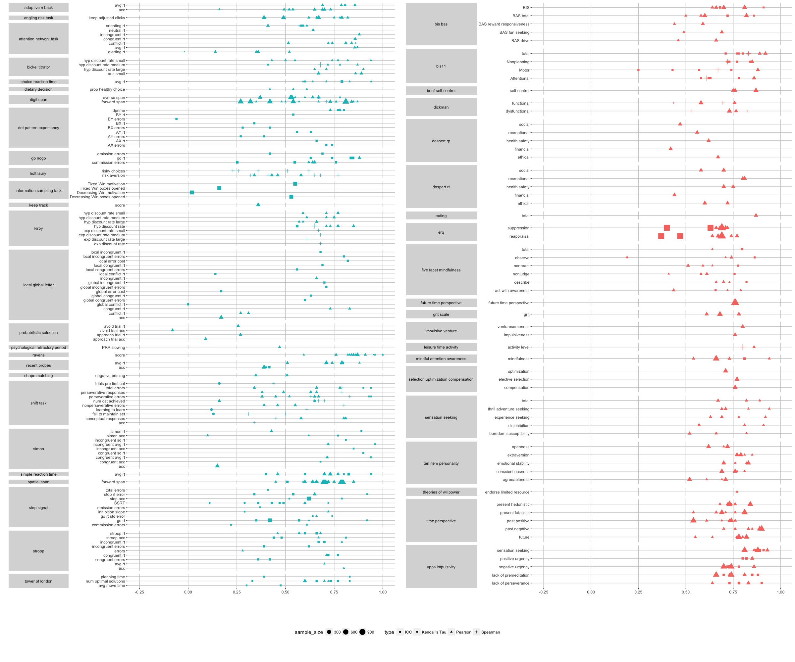

```{r, message=FALSE, warning=FALSE, include=FALSE}
library(dplyr)
library(tidyr)
library(ggplot2)
library(gridExtra)
library(GGally)
library(stringr)
library(plotly)
sem <- function(x) {sd(x, na.rm=T) / sqrt(length(x))}
options(scipen = 1, digits = 4, width = 500)
```

```{r echo=FALSE}
fig_data <- read.csv('../input/lit_review_figure.csv')
```

Interactive plot - not rendered for now

```{r warning=FALSE, message=FALSE, fig.height=36, echo=FALSE, eval=FALSE}
ggplotly(fig_data %>%
  mutate(dv = factor(dv, levels = dv[order(task)]),
         days_cutoff = ifelse(days < 60, days, 120),
         days = paste(days, '; reference:', reference)) %>%
ggplot(aes(x = dv, y = retest_reliability, label=days))+
  geom_point(aes(color = task, size=sample_size, shape = type, alpha = days_cutoff))+
  coord_flip()+
  theme_bw()+
  theme(legend.position="none"),
tooltip = c('sample_size', 'type', 'dv', 'retest_reliability', 'days')) %>%
  layout(showlegend=FALSE)
```

Static plot

```{r warning= FALSE, message =FALSE, fig.height=36, echo=FALSE, eval=FALSE}
fig_data %>%
  mutate(dv = factor(dv, levels = dv[order(task)]),
         days_cutoff = ifelse(days < 60, days, 120),
         days = paste(days, '; reference:', reference)) %>%
ggplot(aes(x = dv, y = retest_reliability, label=days))+
  geom_point(aes(color = task, size=sample_size, shape = type, alpha = days_cutoff))+
  coord_flip()+
  theme_bw()
```

```{r warning=FALSE, message=FALSE}
fig_data = fig_data %>%
  separate(dv, c("task_group", "var"), sep="\\.",remove=FALSE,extra="merge") %>%
  mutate(task_group = factor(task_group, levels = task_group[order(task)]),
         raw1_fit0 = grepl('raw', variable_type),
         type = as.character(type)) %>%
  arrange(task_group, -raw1_fit0)
```

```{r warning= FALSE, message =FALSE, echo=FALSE}
p1_legend = fig_data %>%
  filter(task == 'task') %>%
ggplot(aes(y = var, x = retest_reliability)) + 
  geom_point(aes(size=sample_size, shape=type))+
  facet_grid(task_group~., switch = "y", scales = "free_y", space = "free_y") +
  theme(panel.spacing = unit(0.5, "lines"), 
        strip.placement = "outside",
        strip.text.y = element_text(angle=180),
        panel.background = element_rect(fill = NA),
        panel.grid.major = element_line(colour = "grey80"),
        legend.position = 'bottom') + 
  xlab("")+
  ylab("")+
  scale_x_continuous(limits = c(-0.25,1), breaks=c(-0.25, 0, 0.25, 0.5, 0.75, 1))+
  scale_shape_manual(breaks = sort(fig_data$type), values = c(15, 16, 17, 3))

p1 = fig_data %>%
  filter(task == 'task') %>%
ggplot(aes(y = var, x = retest_reliability)) + 
  geom_point(aes(size=sample_size, shape = type), color='#00BFC4')+
  facet_grid(task_group~., switch = "y", scales = "free_y", space = "free_y") +
  theme(panel.spacing = unit(0.5, "lines"), 
        strip.placement = "outside",
        strip.text.y = element_text(angle=180),
        panel.background = element_rect(fill = NA),
        panel.grid.major = element_line(colour = "grey80"),
        legend.position = 'bottom') + 
  xlab("")+
  ylab("")+
  scale_x_continuous(limits = c(-0.25,1), breaks=c(-0.25, 0, 0.25, 0.5, 0.75, 1))+
  scale_shape_manual(breaks = sort(fig_data$type), values = c(15, 16, 17, 3))

p2 = fig_data %>%
  filter(task == 'survey') %>%
ggplot(aes(y = var, x = retest_reliability)) + 
  geom_point(aes(size=sample_size, shape = type), color = '#F8766D')+
  facet_grid(task_group~., switch = "y", scales = "free_y", space = "free_y") +
  theme(panel.spacing = unit(0.5, "lines"), 
        strip.placement = "outside",
        strip.text.y = element_text(angle=180),
        panel.background = element_rect(fill = NA),
        panel.grid.major = element_line(colour = "grey80")) + 
  xlab("")+
  ylab("")+
  scale_x_continuous(limits = c(-0.25,1), breaks=c(-0.25, 0, 0.25, 0.5, 0.75, 1))+
  scale_shape_manual(breaks = sort(fig_data$type), values = c(15, 17, 3))

g_legend<-function(a.gplot){
  tmp <- ggplot_gtable(ggplot_build(a.gplot))
  leg <- which(sapply(tmp$grobs, function(x) x$name) == "guide-box")
  legend <- tmp$grobs[[leg]]
  return(legend)}

mylegend<-g_legend(p1_legend)

p3 <- arrangeGrob(arrangeGrob(p1 +theme(legend.position="none"),
                         p2 + theme(legend.position="none"),
                         nrow=1),
             mylegend, nrow=2,heights=c(10, 1))

ggsave('Lit_Review_Plot.jpg', plot = p3, device = "jpeg", path = "../output/figures/", width = 24, height = 20, units = "in")
```

```{r echo=FALSE, out.width='100%'}

```
